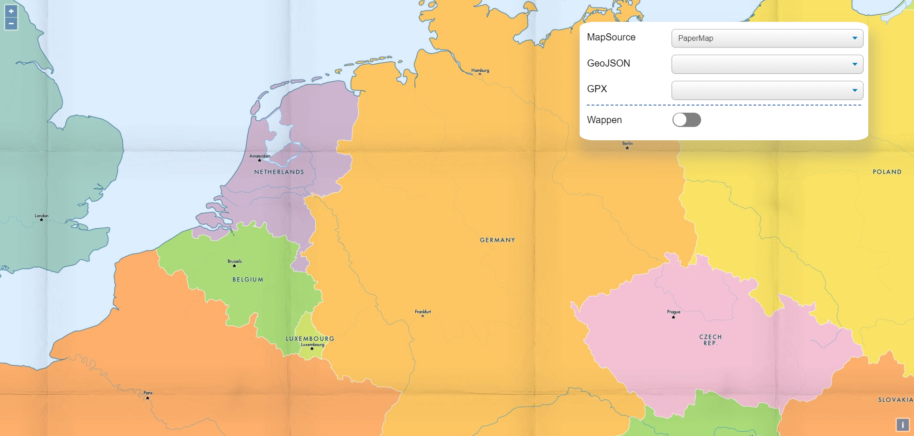
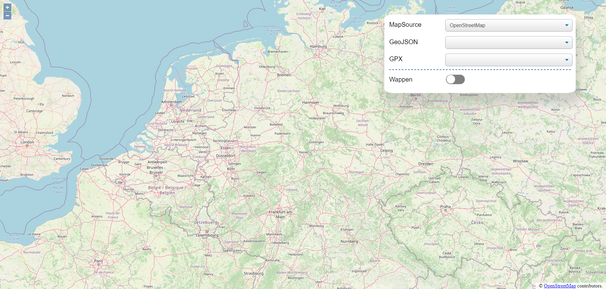
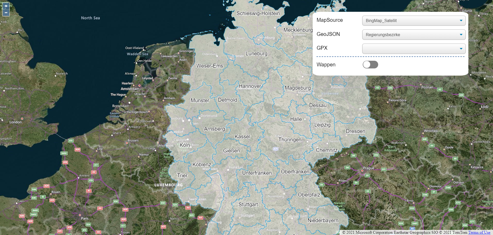
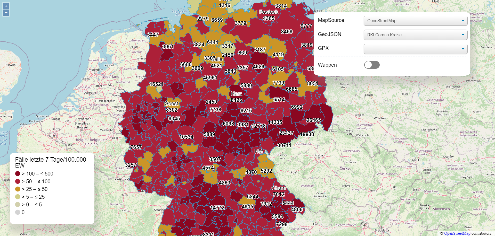
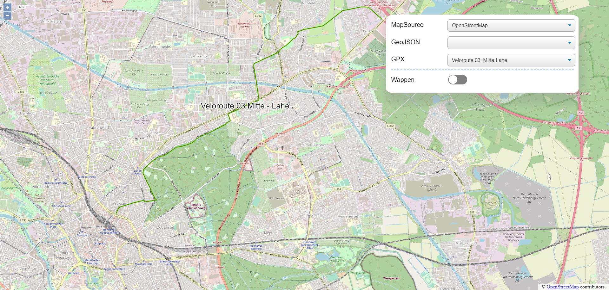
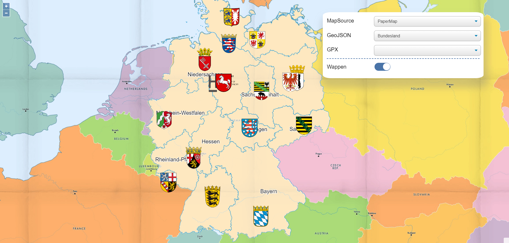

# OpenLayers-Angular-Demo

Dieses Demo hat OpenLayers und Angular zusammengesetzt.

Und Hauptziel davon ist, um die APIs von OpenLayers kennenzulernen.

Bei Source kann man MapSource wählen.
1. Paper Map
2. [OSM](https://www.openstreetmap.de/karte.html)
3. [Bing Map](https://www.bing.com/maps/)

Bei GeoJSON kann man VektorLayer damit bekommen.
Bei GPX kann man Route von GPX datei malen.

## Datenquelle
 - [bundesland.geo.json](https://github.com/isellsoap/deutschlandGeoJSON/blob/master/2_bundeslaender/1_sehr_hoch.geo.json)
 - [regierungsbezirke.geojson](https://github.com/isellsoap/deutschlandGeoJSON/blob/master/3_regierungsbezirke/1_sehr_hoch.geo.json)
 - [kreise.geojson](https://github.com/isellsoap/deutschlandGeoJSON/blob/master/4_kreise/1_sehr_hoch.geo.json)
 - [countries.geo.json](https://github.com/datasets/geo-countries/blob/master/data/countries.geojson)
 - [RKI_Corona_Bundeslaender.geojson](https://opendata.arcgis.com/datasets/ef4b445a53c1406892257fe63129a8ea_0.geojson)
 - [RKI_Corona_Landkreise.geojson](https://opendata.arcgis.com/datasets/917fc37a709542548cc3be077a786c17_0.geojson)

## Screenshots

